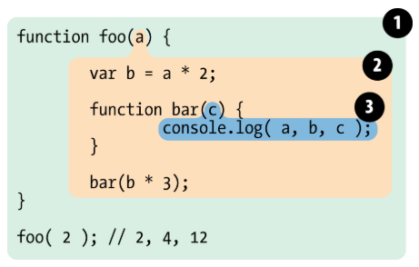

### 文章导航：
[1. 作用域——可访问变量的集合](#1-作用域可访问变量的集合)

[2. 作用域分类](#2-作用域分类)

[3. 执行上下文](#3-执行上下文)

[4. 作用域与执行上下文](#4-作用域与执行上下文)

[5. 作用域链](#5-作用域链)

[6. 作用](#6-作用)
## 1. 作用域——可访问变量的集合
**作用域控制着变量与函数的可见性和生命周期**

 一个代码段所在的区域
它是静态的, 在函数定义时就确定了。
## 2. 作用域分类
1. 全局作用域（代码中任何地方都能访问到的对象拥有全局作用域）
什么对象全局都能访问？
    - 所有window对象
    - 未定义直接赋值的变量
    - 最外层函数和在其外面定义的变量

2. 局部作用域（通过函数创建，它定义的东西只能在其内部访问）

    函数参数只在函数内起作用，是局部变量

**作用域是分层的，内层作用域可以访问外层作用域的变量，反之不行**

- javascript函数的作用域：函数内的区域

- javascript变量的作用域：变量所在区域

    简单理解，JS源代码被函数{ }划分成一块一块的区域，这些区域就是函数/变量的作用域（作用域可能相同）

3. 块级作用域（花括号中的语句集都属于一个块，在这之中定义的所有变量在代码块外都是不可见的）
    - **js没有块级作用域**
    - 声明变量不会提升到代码块顶部
    - 通过新增命令 let 和 const 声明，所声明变量在指定块外无法访问

### 在讲作用域链之前，要先理清一个概念“执行环境”（执行上下文）
## 3. 执行上下文
当代码运行时，会产生一个对应的执行环境，在这个环境中，所有变量会被事先提出来（变量提升），有的直接赋值，有的为默认值 undefined，代码从上往下开始执行，就叫做执行上下文
## 4. 作用域与执行上下文
1. 区别：
    - 每个函数都会创建自己的作用域，作用域在函数定义时就已确定，而不是在函数调用时
    - 全局执行上下文是在全局作用域确定之后, js代码执行之前创建
    - 函数执行上下文是在调用函数时, 函数体代码执行之前创建

    - 作用域是静态的, 只要函数定义好了就一直存在, 且不会再变
    - 执行上下文是动态的, 函数调用时创建, 结束时上下文释放
2. 联系：
    - 上下文环境属于所在的作用域
    - 全局上下文环境==>全局作用域
    - 函数上下文环境==>对应的函数使用域
## 5. 作用域链
- 查找变量的时候，会先从当前上下文的变量对象中查找
- 如果没有找到，就会从父级执行环境的变量对象中查找
- 一直找到全局对象

**这样由多个执行上下文的变量对象构成的链表就叫做作用域链**
## 6. 作用
**隔离变量，不同作用域下同名变量不会有冲突**
