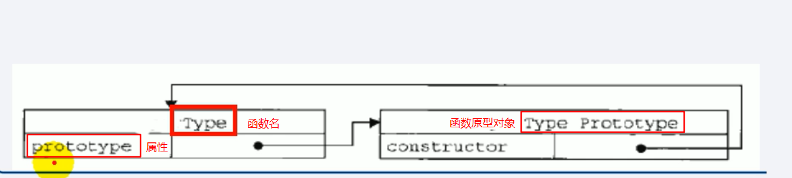
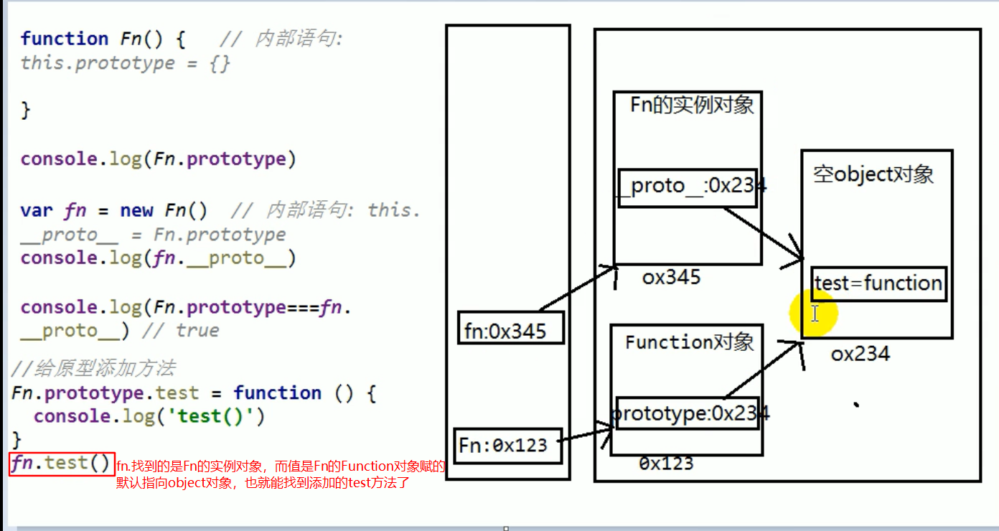
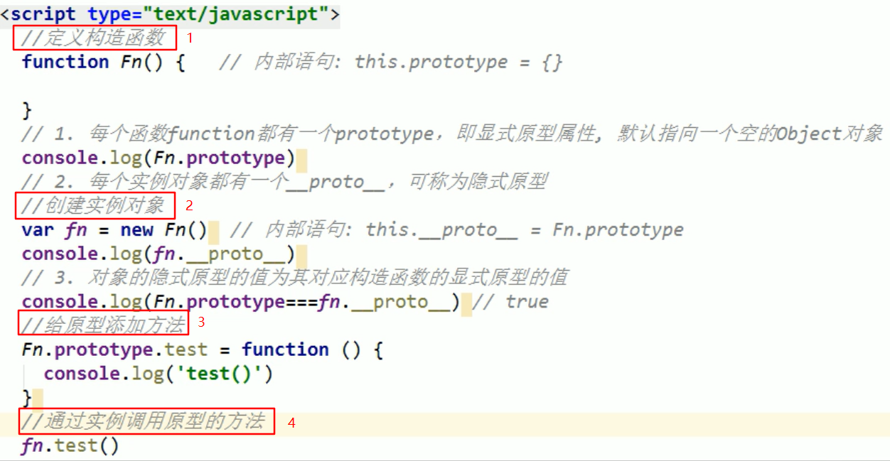
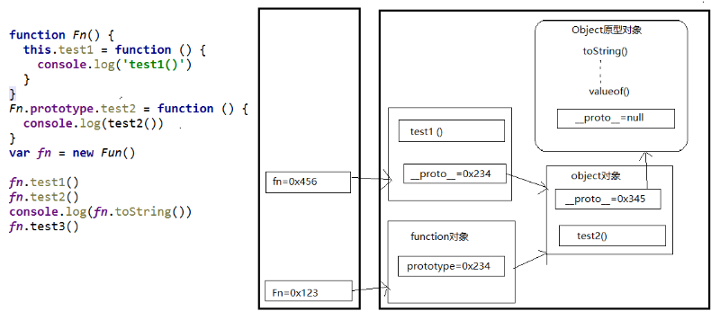

首先，需要了解一个概念“构造函数”

## 构造函数
用 new 关键字来调用的函数，称为构造函数（首字母一般大写）
## 为什么要使用构造函数？
**创建对象时，可能因为对象具有一些相似的特征(属性)和行为(方法)，产生很多重复代码，而使用构造函数就可以实现代码复用。**

举个栗子，录入班同学的个人信息，可以创建一些对象，such as：
```java
var p1 = { name: 'zs', age: 6, gender: '男' };
var p2 = { name: 'ls', age: 6, gender: '女' };
//把每位同学的信息当做一个对象来处理,代码重复很多
```
把name等属性当做构造函数的参数传递进去，创建以下的函数：
```java
function Person(name, gender) {
    this.name = name;
    this.gender = gender;
}
```
创建函数后可通过 new 关键字调用，也就是通过构造函数来创建对象：
```
var p1 = new Person('zs', '男');
var p2 = new Person('ls', '女');
```
## 构造函数执行流程

1. 立即创建一个新的对象

2. 将新建的对象设置为函数中的this，在构造函数中可以用this来引用新的对象

3. 逐行执行函数中的代码

4. 将新建的对象作为返回值返回

**使用同一个构造函数创建的对象，称为一类**
## 1. 原型
### 显式原型（属性）
* 每个构造函数都有一个**prototype**属性（即**显式原型**）
* 在定义函数时自动添加, 默认指向一个Object空对象{ }（原型对象）
* 原型对象中有一个constructor属性, 指向构造函数对象



### 隐式原型（属性）

* 每个实例对象都有一个__proto__属性（即隐式原型）
* 创建对象时自动添加, 默认值为构造函数的prototype属性值
```java
Fn.prototype === fn.__proto__         //true
```
### 原型的内存结构





## 2. 原型链（隐式原型链）
* 访问一个对象的属性（方法）时，先在自身属性中查找，找到返回
* 如果没有, 再沿着__proto__这条链向上查找, 找到返回
* 如果最终没找到, 返回undefined

**Object的原型对象是原型链的尽头**


### 原型链的属性

* 读取对象的属性值时: 会自动到原型链中查找
* 设置对象的属性值时: 不会查找原型链, 如果当前对象中没有此属性, 直接添加此属性并设置其值
* 方法一般定义在原型中, 属性一般通过构造函数定义在对象本身上。
* 定义在原型上的方法会在实例中共享
```java
  function Person(name) {
    this.name = name;
  }
  // 在原型上定义方法
  Person.prototype.setName = function (name) {
    this.name = name;
  }
  Person.prototype.sex = '男';

  var p1 = new Person('Tom', 12)
  p1.setName('Jack')
  p1.sex = '女'
```