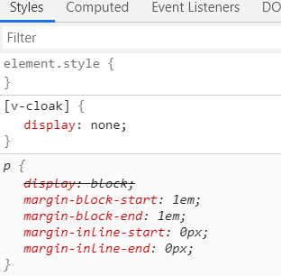
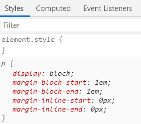

## 1. v-cloak（解决插值表达式{{ }}闪烁的问题）

```html
    <style>
    [v-cloak]{
        display: none;
    }
    </style>

</head>
<body>
    <!-- new 的vue实例，会控制这个元素中的所有内容 -->
    <div id="app">
        <p v-cloak>{{mag}}</p>
    </div>

    <script src="../js/vue.js"></script>
    <!-- 创建一个vue的实例 -->
    <script>
        // 当我们导入包之后，在浏览器的内存中，就多了一个vue构造函数
        var vm = new Vue({
            el:'#app',//el表示，当前new的vue 实例，要控制页面上的哪个区域/节点
            data:{
                mag:'hello vue'//通过vue提供的指令，把数据渲染到页面上，无需手动操作DOM元素
            }
        })
    </script>
</body>
```



**当页面加载到p标签的时候，显示内容会从{{mag}}过渡到hello vue**



## 2. v-text（没有闪烁的问题，但是会完全覆盖元素原有内容）

```html
<body>
    <!-- new 的vue实例，会控制这个元素中的所有内容 -->
    <div id="app">
        　　<p>111{{message}}</p><!--结果显示111I am {{}}-->
        　　<p v-text="text">111</p><!--结果显示<h1>html</h1>-->
        　　<p v-html="html"></p><!--结果显示html的大标题-->
    </div>

    <script src="../js/vue.js"></script>
    <!-- 创建一个vue的实例 -->
    <script>
        　　let app = new Vue({
        　　el: "#app",
        　　data: {
        　　　　message: "I am {{ }}",
        　　　　text: "<h1>html</h1>",
        　　　　html: "<h1>html</h1>"

        　　}
        });
    </script>
</body>
```


## 3. v-html(将占位符里的内容转义输出)

### 插值表达式{{ }}、v-text、v-html的异同
+ 插值表达式{{ }}只会替换占位符里的内容，不会把整个元素的内容清空，占位符前后插入的内容依然可以显示
+ v-text没有闪烁的问题，但是会覆盖元素原有内容
+ 插值表达式{{ }}和v-text只会把占位符里的内容当做普通字符输出，不会转义
+ v-html会将占位符里的内容转义输出

## 4. v-bind（绑定属性）
```html
<input type="button" value="click" v-bind:title="myTitle + '123'">
<input type="button" value="click" :title="myTitle + '123'">
<!-- v-bind：可以简写成： -->
<!-- myTitle:"hhhhhhh" -->
```
### v-bind的三种用法

1. 直接使用指令 v-bind：

2. 使用简写指令 :

3. 在绑定的时候，可拼接绑定内容：

`:title="btnTitle + '追加的内容'"`
## 5. v-on（绑定事件）
简写是@
```html
<!-- 绑定点击事件click或者鼠标移进事件mouseover等等 -->
<input type="button" value="click" v-on:click="show">

<!-- methods: {//定义当前vue实例所有可用的方法
    show: function () {
        alert('hello')
    }

} -->
```