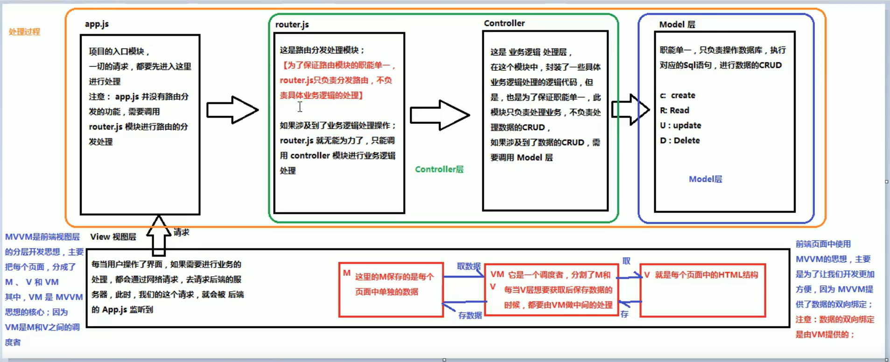

## 1. 概述

三种常见的前端架构模式——MVC、MVP、MVVM

通过**分离关注点**来**改进代码**的组织方式。
+  MVC模式是MVP、MVVM模式的基础

    - 这两种模式更像是MVC模式的优化改良版
    - 他们三个的MV（model，view）相同，不同的是MV之间的纽带部分
## 2. MVC

+ 允许在不改变视图的情况下，改变视图对用户输入的响应方式
+ 用户对View的操作交给了Controller处理
    - 在Controller中响应View的事件调用Model的接口对数据进行操作
    - 一旦Model发生变化便通知相关视图进行更新。

MVC模式可以这样理解成：html=>view,js=>controller

js负责处理用户与应用的交互:
+ 响应对view的操作（对事件的监听）
+ 调用Model对数据进行操作
+ 完成model与view的同步（根据model的改变，通过选择器对view进行操作）
+ 将js的ajax当做Model，也就是数据层，通过ajax从服务器获取数据
## 3. MVVM
MVVM与MVC最大的区别就是：**实现了View和Model的自动同步**

也就是当Model的属性改变时，该属性对应View层显示会自动改变，我们无需手动操作Dom元素来改变View的显示

+ html部分相当于View层，View通过模板语法将数据渲染进DOM元素，当ViewModel对Model进行更新时，通过数据绑定更新到View。

+ data相当于Model层，而ViewModel层的核心是Vue中的双向数据绑定，即Model变化时VIew可以实时更新，View变化也能让Model发生变化。

整体看来，MVVM比MVC精简很多，不仅简化了业务与界面的依赖，还解决了数据频繁更新的问题，不用再用选择器操作DOM元素。

